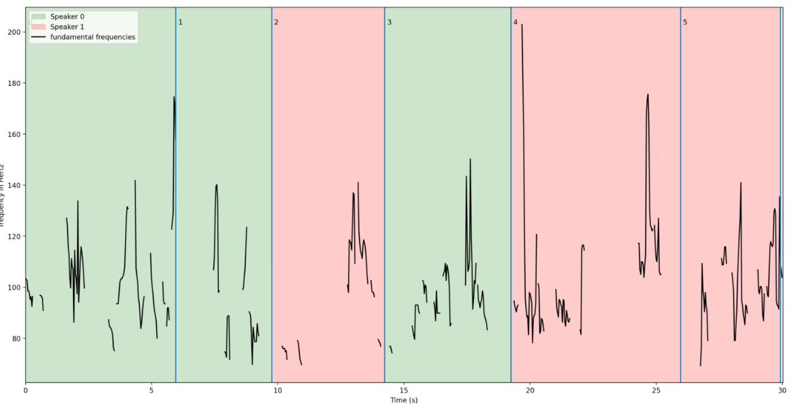
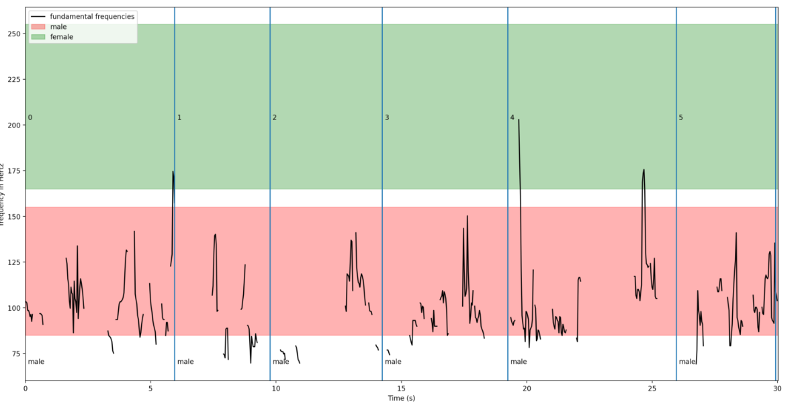
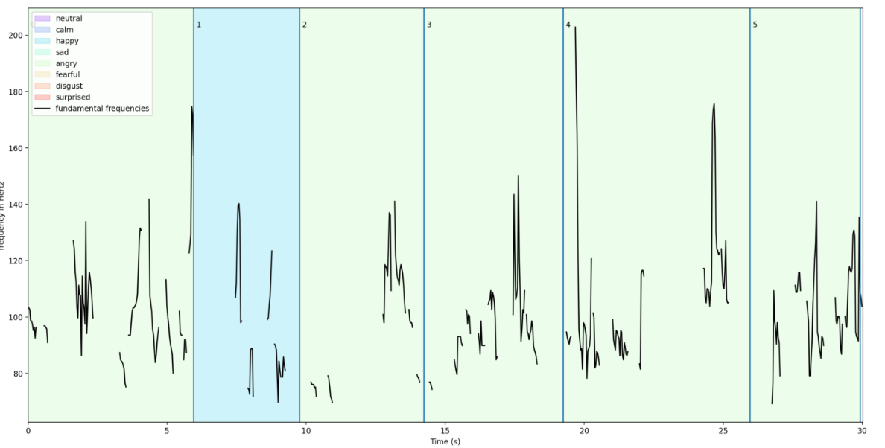

# Audio Annotation Tool
This module provides a simple interface to perform speech transcription and downstream analysis on audio signals.

## Usage

    from annotation import *
    from annotation.outputs import TranscriptionResult

    whisper_decoding_opt = DecodingOptions(
        fp16=True,
        language='de',
    )

    pipe = Pipeline(
        WhisperAnnotator(model_name='medium', decode_options=whisper_decoding_opt),
        SpeakerDiarization(num_speakers=2, device='cpu'),
        SimpleEmotionAnnotator("emotion_classification/emotion_clf.pkl"),
        FundamentalFrequencyAnnotator(),
        GenderClassification(),
        verbose=True
    )

    result: TranscriptionResult = pipe('audio.mp3')
    result.save('out.pkl')

## Output

The output of the pipeline is a TranscriptionResult object. It contains the transcription, the detectect language and
the full annotation as a list of Segment objects. Each Segment object contains the following information:

    id: int # unique id of the segment
    seek: int # seek position in the audio file
    start: float # start time in seconds
    end: float # end time in seconds
    text: str = "" # text transcription
    tokens: list[int] # token ids of the transcription
    audio_features: np.ndarray # whisper audio features of the segment
    avg_logprob: float  # average log probability of the transcription
    no_speech_prob: float  # probability that the segment is no speech
    temperature: float # temperature used for decoding
    compression_ratio: float # compression ratio of the segment
    gender: str = None # gender of the speaker
    speaker: int  # speaker id for speaker diarization
    emotion: int  # emotion id for emotion classification
    emotion_prob: np.ndarray  # emotion probabilities for emotion classification
    fundamental_frequency: np.ndarray # fundamental frequency of the segment

## Annotators

### Speech2Text

The core component of the annotation system is the Speech2Text annotator. It is a small wrapper around
the [Whisper model](https://github.com/openai/whisper)
from OpenAI. Whisper is a transformer-based sequence-to-sequence model that is trained on a large corpus of audio data.
The audio modality is injected into a text transformer using cross-modal attention. This allows the model to improve
the transcription of speech by leveraging the context of the text. A multi-task objective during training allows to
jointly
perform multilingual speech recognition, speech translation, spoken language identification, and voice activity
detection

Given an audio signal that contains speech, it will return a text transcription of the speech along with
an annotation of timestamps for each segment. Many languages are supported (see whisper.tokenizer.LANGUAGES), which are
automatically recognised as long as the decoding parameter is not used. In addition to the transcription, the annotator
will also return the intermediate representation of the model to perform further downstream analysis like emotion
detection.

For details on the model, please refer to the [Whisper paper](https://arxiv.org/abs/2212.04356).

### Emotion Classifier

Classifies the emotion of the speaker in the audio signal into eight different classes: *neutral*, *calm*, *happy*,
*sad*,
*angry*, *fearful*, *disgust*, *surprised*. For this, the intermediate representation of Whisper are used since they
contain rich information about the speaker's voice. The original whisper is modified to output the intermediate
representation.
The emotion classifier is a simple MLP that takes the time-averaged representation as input and outputs the emotion
class.
It is trained on the [RAVEDESS](https://zenodo.org/record/1188976) dataset, that contains speech and song recordings of
24 actors in different emotions. In a 5-fold cross-validation, the model achieves an accuracy of around 74%.

Refer to the emotion_classification/README.md for more details.

### Fundamental Frequency

The fundamental frequency (F0) is the lowest frequency of a sound wave. It is a measure of the pitch of a sound and can
be useful for further analysis. The
annotator [PYIN algorithm](https://www.eecs.qmul.ac.uk/~simond/pub/2014/MauchDixon-PYIN-ICASSP2014.pdf)
to estimate the F0. The running time and precision of the result is very sensitive and must be tuned according to the
task.

### Gender Classification

A simple approach to classify a speaker into male and female is to use the F0. The annotator uses the F0 to classify the
gender based on a simple threshold. For this, the mean value of the fundamental frequency of a defined section is used.
If this is between 85 and 155, it is probably a man. If it is between 165 and 255, it is a woman. Otherwise, it is
unknown.

Future work could improve this by using a more sophisticated model or by using the intermediate representation of the
Whisper model.

### Speaker Diarization

The task of speaker diarization is to identify the speakers in a recording. The annotator uses
the [SpeechBrain](https://arxiv.org/pdf/2106.04624.pdf) model to
create representations for audio segments. These representations are then clustered using a hierarchical clustering
algorithm. The number of total speaker must be provided as a parameter. The annotator returns the speaker id for each
segment. A problem of this method is that it is not robust to overlapping speech and that a segment is not necessarily
assigned to the same speaker.

Future work could try to leverage the intermediate representation of the Whisper model to improve the speaker
diarization.
Preliminary experiments show that simply using the representation does not work well.

### Intonation
The intonation describes the variation of the pitch during speech. It is a useful feature for further analysis.  
The annotator uses the script [ProsoTool](https://ieeexplore.ieee.org/document/7390606) for [Praat](https://www.fon.hum.uva.nl/praat/)
to extract the intonation of the speech. The script is uses the fundamental frequency to calculate the pitch contour and
information about the speaker's voice to estimate the pitch range.

## Disfluencies in Whisper

Whisper is trained on a large corpus of audio data. This includes many disfluencies like repetitions, fillers, and
pauses. But during training, these disfluencies are not annotated. Therefore, the model does not learn to output them.
One possible technique to improve the annotation of these disfluencies is to **prefix** the text-model of Whisper with a
prompt that contains disfluencies. This puts the model into a mode that tends to produce better results. An evaluation
of this process is open for later work. The initial_prompt parameter of the annotators DecodingOptions can be used to
provide the prompt.

Example:

**Prefix**: *"Ähm, lass mich mal überlegen, mhm ... Okay."*

**Whisper:**

*Ja, weil da siehst du trotzdem sehr viele Szenarien, aus denen du lernen kannst.
Das sind zwar ausgedachte Szenarien alles, aber...*

**Whisper + Prefix:**

*Ja, weil da siehst du trotzdem sehr viele Szenarien, aus denen du lernen kannst.
Mhm.
Das sind zwar ausgedachte Szenarien alles, aber...*

## Frontend

A simple frontend is provided to visualize the results. The path to the annotations is needed. It can be started with:

    streamlit run frontend.py

Here is an example of the frontend output:

### Speaker Diarization

### Gender Classification

### Emotion Classification

