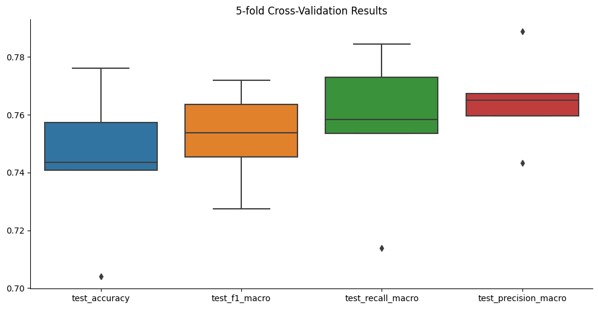

# Emotion Classification 
*Author: Timothy Schaumlöffel*

Classification of emotions from audio files using representations from Whisper.

1. Use Whisper to extract representations from audio files. Average the representations over time to get a single
   representation for each audio file of size 1024.
2. Train a classifier on the representations.
3. Evaluate the classifier.
4. Use the classifier to predict emotions for new audio files during annotation.

## Dataset

The Ryerson Audio-Visual Database of Emotional Speech and Song (RAVDESS)

Download for https://zenodo.org/record/1188976:

* Audio_Song_Actors_01-24.zip
* Audio_Speech_Actors_01-24.zip

## Classes

    {
        0: 'neutral',
        1: 'calm',
        2: 'happy',
        3: 'sad',
        4: 'angry',
        5: 'fearful',
        6: 'disgust',
        7: 'surprised'
    }

## Results

We use a simple MLP with layer sizes (256, 128, 64, 32), ReLU activations and adaptive learning rate, that decreases
after 2 epochs without improvement. The initial learning rate is 0.001.

## Future Work

The model overfits on the training data. This is likely due to the small size of the dataset and the limited concepts of
emotion
in the RAVEDESS dataset. Future work could include:

* Use more data + data augmentation
* Use a more expressive model
* Use a more expressive representation from Whisper (larger model), time information, etc.

